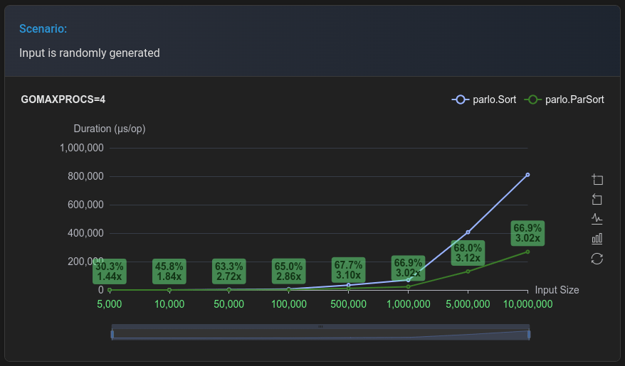

## Parlo: A Performant, Parallel Utility Library for Go

Parlo is a Go library that provides utility functions for efficiently working with slices, maps, and channels.

[](https://pkg.go.dev/github.com/mahdi-shojaee/parlo)
[](https://github.com/mahdi-shojaee/parlo/actions/workflows/test.yml)




View all benchmark results at: [https://mahdi-shojaee.github.io/parlo/](https://mahdi-shojaee.github.io/parlo/)

### Key Advantages:

* **Parallel Processing:** Parlo leverages Go's concurrency features to provide parallel versions of several functions. This allows you to utilize multiple CPU cores and significantly improve performance for large datasets.
* **Generics:** Parlo utilizes Go's generics system (available in Go 1.18 and later) to eliminate the need for reflection in many functions. This translates to better **type safety** and improved performance compared to reflection-based approaches.

### Current Features:

* **Slices:** Sequential and parallel versions of `Sort`, `IsSorted`, `Min`, `Filter`, etc.

**(Note: The list of features is subject to change based on development progress.)**

### Installation:

```
go get -u github.com/mahdi-shojaee/parlo
```

### Usage:

```Go
package main

import (
  "fmt"

  "github.com/mahdi-shojaee/parlo"
)

func main() {
  data := []int{5, 2, 4, 1, 3}

  // Sequential Sort
  parlo.Sort(data)
  fmt.Println("Sequential:", data)

  // Parallel Sort
  data = []int{5, 2, 4, 1, 3}
  parlo.ParSort(data)
  fmt.Println("Parallel:", data)
}
```

### Parallel Functions

All parallel versions of functions are prefixed with `Par`, indicating they utilize multi-core processing for better performance. For example, `ParMap`, `ParFilter`, and `ParSort` are the parallel counterparts of their sequential versions.

### Benchmarking

Parlo includes a comprehensive benchmarking system to measure and compare the performance of sequential and parallel functions.

#### Defining Benchmarks

Benchmarks are defined in the `charts/benchmark/benchconfigs.yml` file. For detailed instructions on adding new benchmarks, please refer to the [Benchmark Configuration Guide](charts/benchmark/benchmark_configuration_guide.md).

#### Running Benchmarks

To run benchmarks, use the following command from the `charts` directory:

```
cd charts
go run main.go [options] [benchmark names...]
```

##### Options:
- `-benchtime=<duration>`: Set the benchmark time for each test (default: 1s)

Note: Some benchmarks like `Sort` may require longer benchmark times for accurate results. Adjust the `-benchtime` flag accordingly when running these benchmarks.

Examples:
```
# Run all benchmarks
go run main.go -all

# Run Sort and SortFunc benchmarks with a 4s benchmark time
go run main.go -benchtime=4s Sort SortFunc

# Generate the `benchmark-results.js` file for the viewer without running any benchmarks
go run main.go -build
```

#### Viewing Benchmark Results

After running benchmarks, results are saved as JSON files in the `charts/benchmark-results-viewer/benchmark-results/` directory.

To view the results:

1. Run `go run main.go -build` to generate the `benchmark-results.js` file.
2. Open `charts/benchmark-results-viewer/index.html` in a web browser.

You can also view the latest benchmark results online at: [https://mahdi-shojaee.github.io/parlo/](https://mahdi-shojaee.github.io/parlo/)

The viewer provides interactive charts comparing the performance of sequential and parallel functions across different input sizes and scenarios.

### Contributing:

We welcome contributions to Parlo! Feel free to open issues, submit pull requests, or reach out for discussions.

### License:

Parlo is licensed under the [MIT License](https://opensource.org/licenses/MIT).

### Stay Updated:

Follow this repository for updates and new feature announcements.
